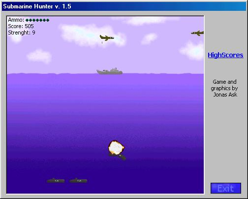



## SubHunter v\. 1\.5

### Description

Sub Hunter game. Kinda simple, but fun when you have nothing else to do. New sice 1.0: Explosions, some preformance and a easteregg :) (Love that King ;)
 
### More Info
 

             |
---                |---
**Submitted On**   |2001-08-18 22:41:22
**By**             |[Jonas Ask](https://github.com/Planet-Source-Code/PSCIndex/blob/master/ByAuthor/jonas-ask.md)
**Level**          |Intermediate
**User Rating**    |4.9 (78 globes from 16 users)
**Compatibility**  |VB 6\.0
**Category**       |[Games](https://github.com/Planet-Source-Code/PSCIndex/blob/master/ByCategory/games__1-38.md)
**World**          |[Visual Basic](https://github.com/Planet-Source-Code/PSCIndex/blob/master/ByWorld/visual-basic.md)
**Archive File**   |[SubHunter 249038182001\.zip](https://github.com/Planet-Source-Code/jonas-ask-subhunter-v-1-5__1-26354/archive/master.zip)

### API Declarations

None of worry :)

